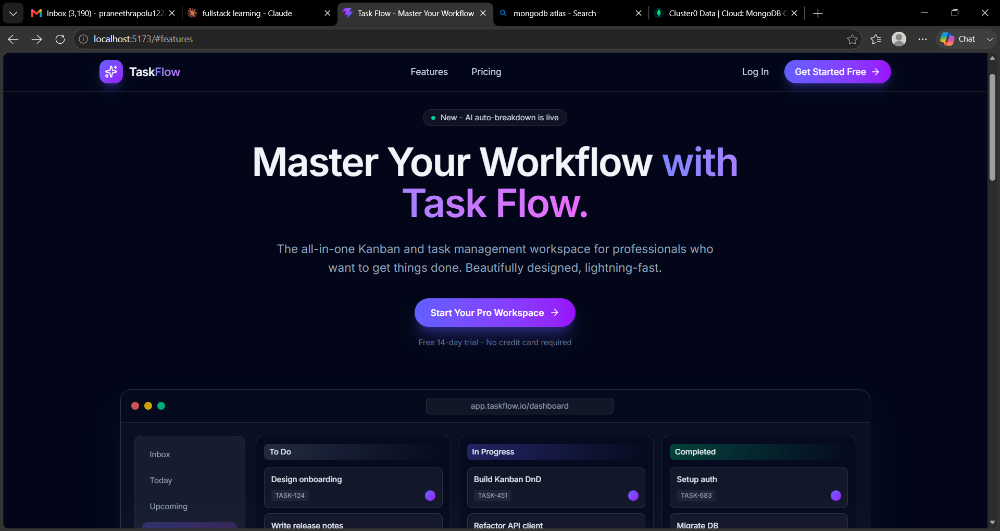
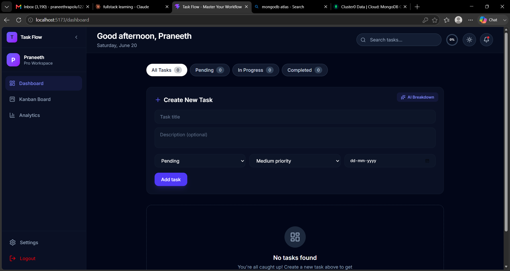
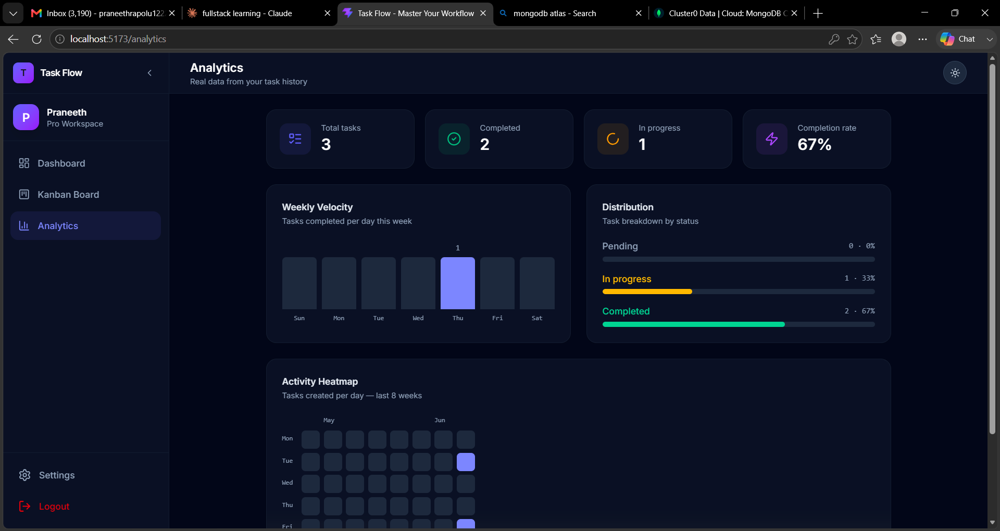

# TaskFlow — Professional Task Management Platform

<div align="center">


[](https://react.dev)
[](https://typescriptlang.org)
[](https://nodejs.org)
[](https://mongodb.com)
[](https://tailwindcss.com)
[](https://jwt.io)

**A full-stack task management platform with Kanban boards, real-time analytics, drag-and-drop, and a stunning dark/light UI — built from scratch with the MERN stack and TypeScript.**

[🚀 Live Demo](#) · [📖 Documentation](https://docs.google.com/document/d/1FiO1J-5pUqkBOxDHUtSX_GHLDzb1c31V/edit?usp=sharing&ouid=111335776956199830503&rtpof=true&sd=true) · [🐛 Report Bug](#) · [✨ Request Feature](#)

</div>

---

## 📸 Screenshots

| Landing Page | Dashboard |
|---|---|
|  |  |

| Kanban Board | Analytics |
|---|---|
|  |  |

> 💡 Replace placeholder images above with real screenshots of your running app.

---

## ✨ Features

### 🎯 Core Task Management
- **Full CRUD** — Create, read, update, and delete tasks with title, description, status, priority, and due date
- **Priority Levels** — Low / Medium / High with color-coded left-edge indicator on every card
- **Due Date Tracking** — Overdue tasks automatically highlighted with a warning badge
- **Status Filtering** — Filter pills that double as live stats (All · Pending · In Progress · Completed)
- **Live Search** — Instant title filtering as you type

### 📋 Kanban Board
- **Drag-and-drop** across Pending, In Progress, and Completed columns powered by `@dnd-kit`
- **Optimistic UI updates** — cards move instantly, API syncs in the background
- **Auto-revert** — if the API call fails, the board snaps back to the correct state
- **Floating drag overlay** — ghost card follows the cursor during drag

### 📊 Analytics Dashboard
- **4 Live Stat Cards** — Total tasks, Completed, In Progress, Completion Rate %
- **Weekly Velocity Chart** — Bar chart of tasks completed per day this week (from real `completedAt` timestamps)
- **Status Distribution** — Animated percentage bars for each status
- **8-Week Activity Heatmap** — GitHub-style heatmap of task creation activity

### 🎨 UI / UX
- **Dark / Light theme toggle** — persisted in localStorage, no OS dependency
- **Collapsible sidebar** — expands to full labels, collapses to icon-only mode
- **Progress ring** — SVG circle in the header showing real completion percentage
- **Glassmorphism design** — frosted glass cards, gradient accents, smooth transitions
- **Fully responsive** — works on mobile, tablet, and desktop

### 🔐 Authentication
- **JWT-based auth** — secure token issued on login, verified on every protected request
- **bcrypt password hashing** — passwords never stored in plain text
- **Protected routes** — unauthenticated users redirected to login automatically
- **Session persistence** — stays logged in across page refreshes via localStorage

### 🌐 Landing Page
- Scroll-aware frosted navbar
- Animated hero with live Kanban board preview
- Features grid, Pricing tiers, Final CTA, and Footer

---

## 🛠 Tech Stack

### Frontend
| Technology | Purpose |
|---|---|
| React 18 + TypeScript | UI framework with full type safety |
| Vite | Lightning-fast dev server and bundler |
| Tailwind CSS v4 | Utility-first styling with dark mode |
| React Router v6 | Client-side routing and protected routes |
| Axios | HTTP client with request interceptors |
| @dnd-kit | Accessible drag-and-drop for Kanban |
| lucide-react | Icon library |
| Context API | Global auth and theme state management |

### Backend
| Technology | Purpose |
|---|---|
| Node.js + Express | REST API server |
| MongoDB + Mongoose | NoSQL database with schema validation |
| JSON Web Tokens (JWT) | Stateless authentication |
| bcryptjs | Password hashing |
| dotenv | Environment variable management |
| CORS | Cross-origin request handling |

### Infrastructure
| Service | Purpose |
|---|---|
| MongoDB Atlas | Cloud-hosted database (free tier) |
| Render | Backend hosting (free tier) |
| Vercel | Frontend hosting (free tier) |

---

## 📁 Project Structure

```
task-manager/
│
├── backend/
│   ├── controllers/
│   │   ├── authController.js      # Register, Login (JWT)
│   │   └── taskController.js      # Full CRUD + completedAt auto-stamp
│   ├── middleware/
│   │   └── authMiddleware.js      # JWT protect middleware
│   ├── models/
│   │   ├── User.js                # User schema (name, email, password)
│   │   └── Task.js                # Task schema (title, status, priority, dueDate, completedAt)
│   ├── routes/
│   │   ├── authRoutes.js          # POST /api/auth/register, /login
│   │   └── taskRoutes.js          # GET/POST /api/tasks, GET/PUT/DELETE /api/tasks/:id
│   ├── .env                       # Environment variables (not committed)
│   └── server.js                  # Express app entry point
│
└── frontend/
    └── src/
        ├── api/
        │   ├── axios.ts            # Axios instance + JWT interceptor
        │   ├── authApi.ts          # registerUser, loginUser
        │   └── taskApi.ts          # getTasks, createTask, updateTask, deleteTask
        ├── components/
        │   ├── Layout.tsx          # Sidebar + main content wrapper
        │   ├── Sidebar.tsx         # Collapsible nav sidebar
        │   ├── TaskForm.tsx        # Reusable create/edit form
        │   └── TaskCard.tsx        # Task card with priority bar + overdue badge
        ├── context/
        │   ├── AuthContext.tsx     # Global auth state (user, login, logout)
        │   └── ThemeContext.tsx    # Dark/light theme toggle
        ├── pages/
        │   ├── LandingPage.tsx     # Public marketing page
        │   ├── Login.tsx           # Auth — login form
        │   ├── Register.tsx        # Auth — register form
        │   ├── Dashboard.tsx       # Main task list view
        │   ├── Kanban.tsx          # Drag-and-drop Kanban board
        │   ├── Analytics.tsx       # Charts and heatmap
        │   └── Settings.tsx        # Settings placeholder
        └── types/
            └── index.ts            # TypeScript interfaces (User, Task)
```

---

## 🚀 Getting Started

### Prerequisites
- Node.js v18+
- npm v9+
- A free [MongoDB Atlas](https://mongodb.com/atlas) account

### 1. Clone the repository

```bash
git clone https://github.com/yourusername/task-manager.git
cd task-manager
```

### 2. Set up the Backend

```bash
cd backend
npm install
```

Create a `.env` file in the `backend/` folder:

```env
PORT=5000
MONGO_URI=mongodb+srv://<username>:<password>@cluster0.xxxxx.mongodb.net/taskmanager?retryWrites=true&w=majority
JWT_SECRET=your_super_secret_jwt_key_here
```

> ⚠️ Never commit your `.env` file. It is already listed in `.gitignore`.

Start the backend:

```bash
npm run dev
```

You should see:
```
MongoDB Connected
Server running on port 5000
```

### 3. Set up the Frontend

```bash
cd ../frontend
npm install
npm run dev
```

Open [http://localhost:5173](http://localhost:5173) in your browser.

---

## 🔌 API Reference

### Auth Endpoints
| Method | Endpoint | Description | Auth Required |
|---|---|---|---|
| POST | `/api/auth/register` | Register a new user | No |
| POST | `/api/auth/login` | Login and receive JWT token | No |

### Task Endpoints
| Method | Endpoint | Description | Auth Required |
|---|---|---|---|
| GET | `/api/tasks` | Get all tasks for logged-in user | ✅ Yes |
| POST | `/api/tasks` | Create a new task | ✅ Yes |
| GET | `/api/tasks/:id` | Get a single task | ✅ Yes |
| PUT | `/api/tasks/:id` | Update a task | ✅ Yes |
| DELETE | `/api/tasks/:id` | Delete a task | ✅ Yes |

### Request Body Examples

**Register / Login**
```json
{
  "name": "Praneeth",
  "email": "praneeth@example.com",
  "password": "securepassword123"
}
```

**Create / Update Task**
```json
{
  "title": "Build the Kanban board",
  "description": "Implement drag-and-drop with @dnd-kit",
  "status": "in-progress",
  "priority": "high",
  "dueDate": "2026-06-30"
}
```

All protected endpoints require an `Authorization` header:
```
Authorization: Bearer <your_jwt_token>
```

---

## 🌍 Deployment

### Backend → Render

1. Go to [render.com](https://render.com) → New Web Service
2. Connect your GitHub repository
3. Set **Root Directory** to `backend`
4. Set **Build Command** to `npm install`
5. Set **Start Command** to `node server.js`
6. Add Environment Variables:
   - `MONGO_URI` — your MongoDB Atlas connection string
   - `JWT_SECRET` — your secret key
   - `NODE_ENV` — `production`
7. Click **Deploy**

### Frontend → Vercel

1. Go to [vercel.com](https://vercel.com) → New Project
2. Import your GitHub repository
3. Set **Root Directory** to `frontend`
4. Set **Framework Preset** to `Vite`
5. Add Environment Variable:
   - `VITE_API_URL` — your Render backend URL (e.g. `https://task-manager-api.onrender.com/api`)
6. Click **Deploy**

> 📝 After deploying the backend, update your `frontend/src/api/axios.ts` baseURL to point to the Render URL in production.

---

## 🔒 Environment Variables

### Backend (`backend/.env`)
| Variable | Description | Example |
|---|---|---|
| `PORT` | Server port | `5000` |
| `MONGO_URI` | MongoDB Atlas connection string | `mongodb+srv://...` |
| `JWT_SECRET` | Secret key for signing JWT tokens | `mysecretkey123` |

### Frontend (`frontend/.env`)
| Variable | Description | Example |
|---|---|---|
| `VITE_API_URL` | Backend API base URL | `http://localhost:5000/api` |

---

## 🤝 Contributing

Contributions, issues, and feature requests are welcome!

1. Fork the repository
2. Create your feature branch: `git checkout -b feature/AmazingFeature`
3. Commit your changes: `git commit -m 'Add some AmazingFeature'`
4. Push to the branch: `git push origin feature/AmazingFeature`
5. Open a Pull Request

---

## 👨‍💻 Author

**Praneeth**

- 🎓 B.Tech Computer Science & Engineering — Vardhaman College of Engineering, Hyderabad
- 🌐 [GitHub](https://github.com/rapolupraneeth)
- 💼 [LinkedIn](https://www.linkedin.com/in/praneeth-rapolu-241603293)
- 📧 praneethrapolu1222@gmail.com

---

## 📄 License

This project is licensed under the MIT License — see the [LICENSE](LICENSE) file for details.

---

<div align="center">

⭐ Star this repo if you found it helpful!

</div>
